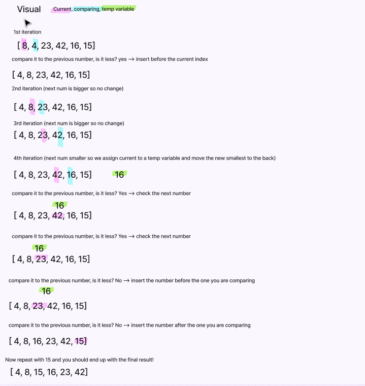

# Insertion Sort

Here is what our code will look like, the comments explain each block.

```js
const insertionSort = arr => {
    for (let i = 0; i<arr.length; i++) {
        // set our temp variable equal to the temp index - 1 ( this is a placeholder )| First iteration: -1
        let j = i - 1;
        // create a variable to store the value of the current index
        let temp = arr[i];

        // while j is not 0 AND the temp value is not less than the value before it
        while(j>= 0 && temp < arr[j]) {
            // set the first idex of the array to the value of the array[j]
            arr[j + 1] = arr[j];
            j--
        }
        // our new temp
        arr[j + 1 ] = temp;
    }
    return arr
}
console.log(insertionSort([8,4,23,42,16,15]));
```

 Here is a visual aid for each step of the process.

 
 