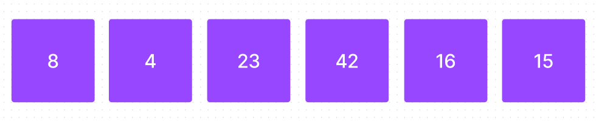
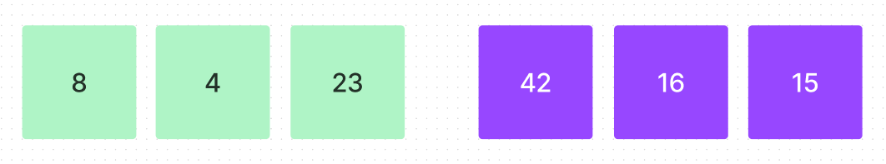
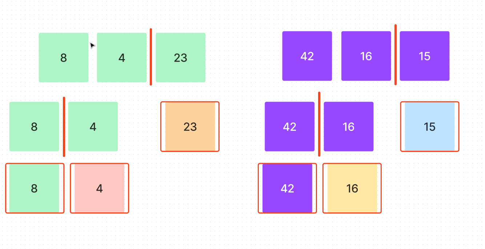
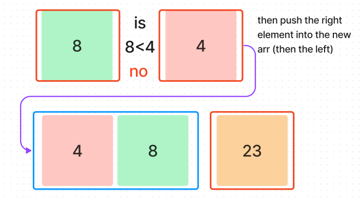
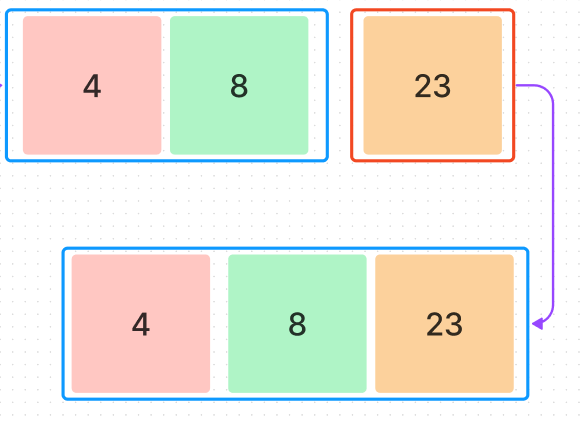
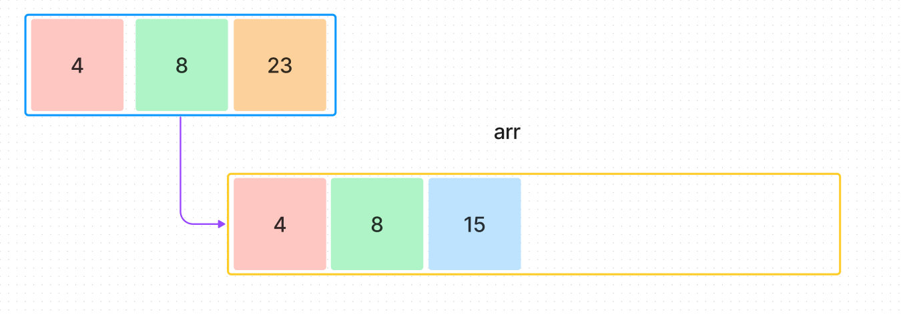
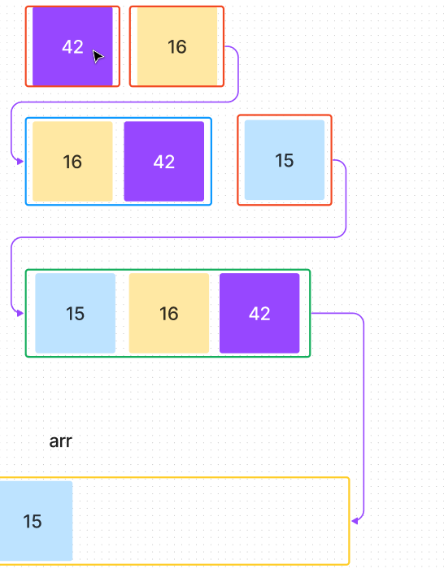
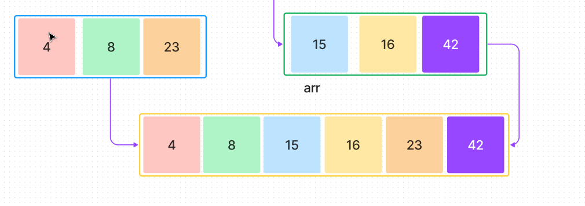

# Merge Sort

In this article I will:

1. explain our problem, what is a merge sort?
2. define an algorithm that performs the merge sort.
3. give a step by step walkthrough with a visual that demonstrates the solution.

### What is a merge sort?

A merge sort is an algorithm that works by splitting the input array in half, then recursively calls itself on each half. Once that is complete, 
we merge the two sorted halfs and end up with our sorted array. 

### Algorithm

Now that we have our problem defined, lets approach how we will perform this. There will be 2 seperate sections since you need two functions to perform this sort.

1. write a function called merge that takes in the left array and the right array as parameters.
2. create an empty array inside the function named arr.
3. while both arrays have elements in them
   1. check if the first index of the left array is less than the first index of the right array.
   2. if true, push the first element of the left array into arr.
   3. else, push the first element of the right array into arr.
4. return arr

---

1. write a function called mergeSort that takes in an array
2. create a variable named midpoint that divides the array length and rounds down
3. if array length is less than 2, stop
4. create a variable named left that splits the array in half (represents the left half of the array)
5. call merge recurisvely on both the left and right side of the array.

### Visualization

Because this is happening recursively it can be hard to follow. Lets walk through the same steps as above with a diagram.

1. Starting with our input array

2. we split it into two halves.

3. We keep splitting it until it cant be split any further.

Now that our arrays cant be split any further, we can start comparing them. After we compare them, we will push them into the array in a sorted manner, then use recursion to repeat this process until all arrays have been merged. Lets start on the left side.

Then our leftover element on the right side get compared in the same manner. Each time this happens we are shifting them out and pushing them to a new array.

Finally, we push them to the empty array we created (arr)

Now, repeat on the other side and you will have a sorted array!
 

